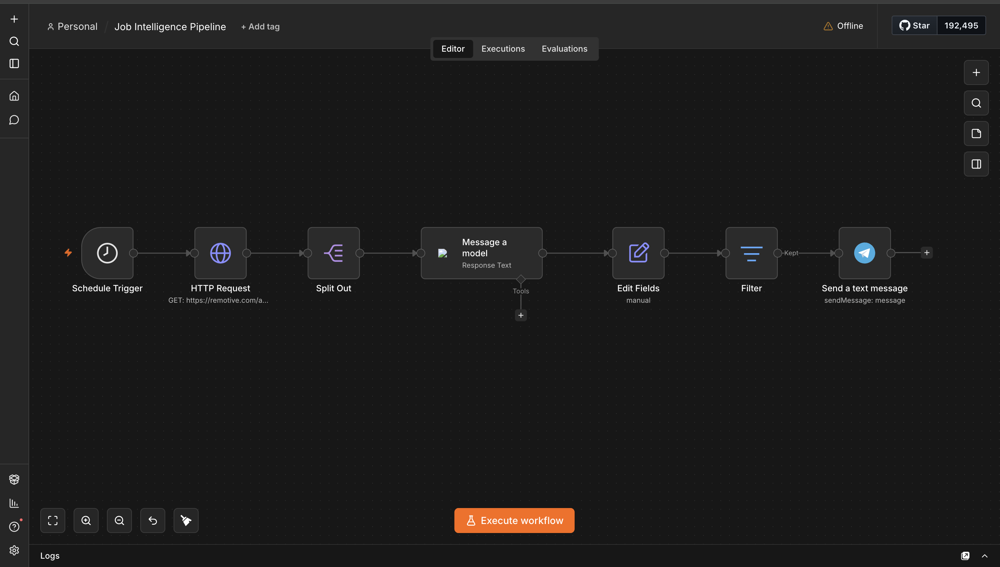

# Job Intelligence Pipeline

> Automated job-monitoring system with LLM-powered relevance scoring.
> Built as a business process automation case study using n8n, OpenAI API, and Telegram.

---

## Business problem

Actively job-seeking professionals spend 2 to 3 hours daily manually checking job boards, copying listings into spreadsheets, and assessing relevance, only to find that around 80% of reviewed postings don't match their profile. There is no deduplication, no structured data extraction, and no prioritization mechanism.

**Estimated waste:** 10 to 15 hours per week per active job seeker.

---

## Solution

An automated n8n pipeline that runs every morning, collects new job postings via API, scores each posting for relevance using an LLM, filters out the noise, and delivers a structured digest to Telegram.

**Result:** 2 to 3 hours per day reduced to a 5-minute review of pre-ranked results.

---

## Process: AS-IS vs TO-BE

| Step | AS-IS (manual) | TO-BE (automated) |
| --- | --- | --- |
| Data collection | Manual browsing across 4+ job boards | n8n HTTP Request via Remotive API |
| Deduplication | None | Structured per-item processing |
| Relevance filtering | Manual reading (~80% irrelevant) | LLM scoring with profile match |
| Data extraction | Copy-paste | Structured fields: score, summary, url |
| Prioritization | None | Filter keeps only relevant results |
| Output | Unstructured notes | Telegram digest with ranked results |
| Time required | 2 to 3 hours per day | 5 minutes per day |

---

## Architecture

The pipeline is built in n8n as a linear workflow of seven nodes:

1. **Schedule Trigger** starts the workflow automatically every morning
2. **HTTP Request** calls the Remotive API (`GET /api/remote-jobs`) and pulls the latest job postings
3. **Split Out** breaks the returned array into individual job items so each one is processed separately
4. **Message a Model (LLM)** evaluates each job against a defined candidate profile and returns a relevance assessment as structured text
5. **Edit Fields** maps the LLM output and job data into clean, consistent fields (score, summary, link)
6. **Filter** keeps only the postings that pass the relevance threshold, so irrelevant jobs never reach the user
7. **Send a Text Message** delivers the final ranked digest to Telegram

The full workflow is included in this repository as `job_pipeline.json` and can be imported directly into any n8n instance.

---

## Stack

| Layer | Tool |
| --- | --- |
| Orchestration | n8n |
| Data source | Remotive API (REST) |
| Relevance scoring | OpenAI API (GPT-4o-mini) |
| Output channel | Telegram Bot API |
| Scheduling | n8n Schedule Trigger |

---

## What this project demonstrates

- **Process analysis:** documenting an AS-IS process, identifying waste, and designing a TO-BE process
- **Requirements thinking:** defining what "relevant" means and encoding it into LLM scoring criteria
- **Workflow design:** building a multi-step automated pipeline with branching and filtering logic
- **API integration:** connecting a data source, an LLM, and a messaging channel into one flow
- **Business value:** translating 10 to 15 wasted hours per week into a 5-minute daily routine

---

## Status

Built and running. The workflow is exported and reproducible from `job_pipeline.json`.

---

## Author

Ekaterina Sarycheva, Prague
AI Business Analyst, turning business problems into working automation.
